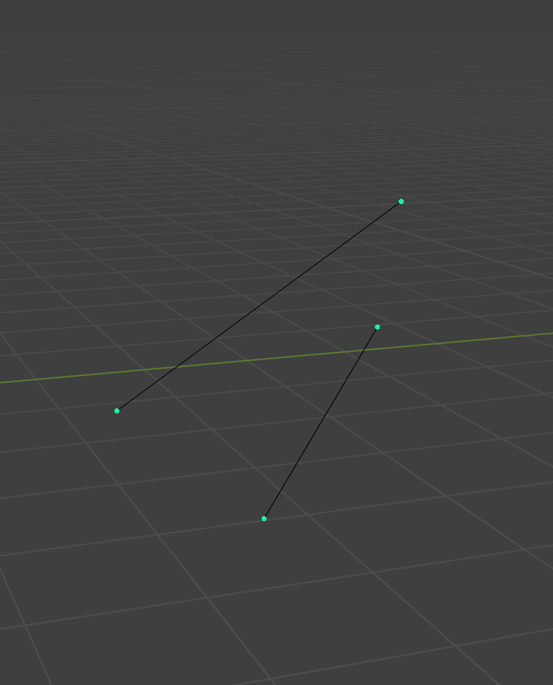
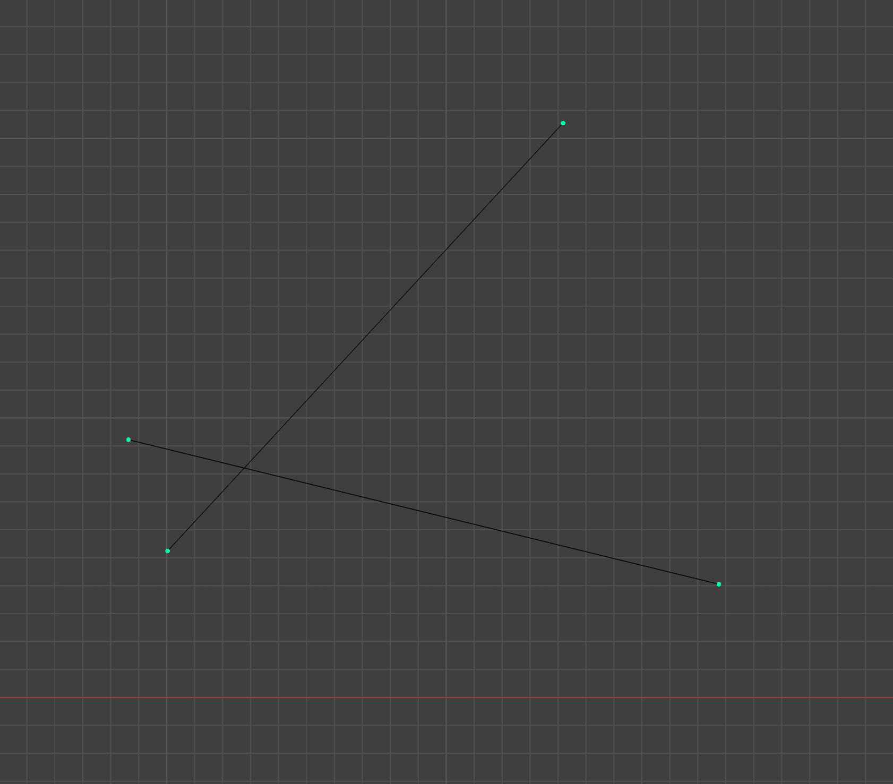
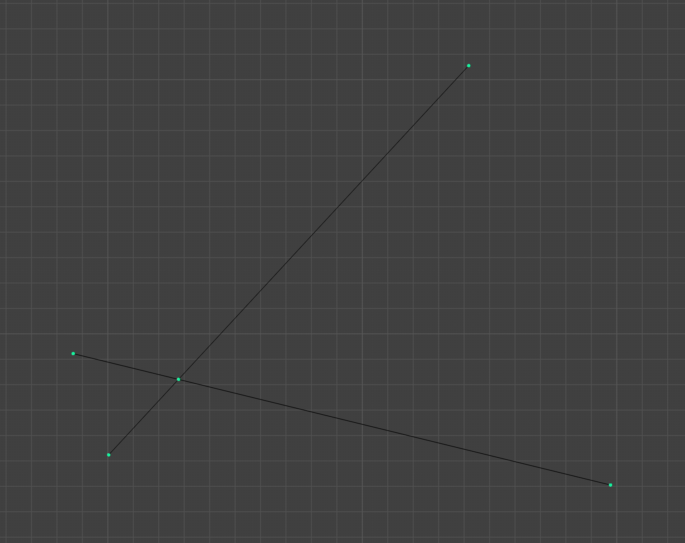

Blender Edge Projector

Given a pair of edges in 3d space, which don't touch:

this script calculates their intersection  point when viewed from a orthographic perspective:

resulting: 

Usage:
- in edit mode select two edges
- make sure you are using the ortographic camera
- run script